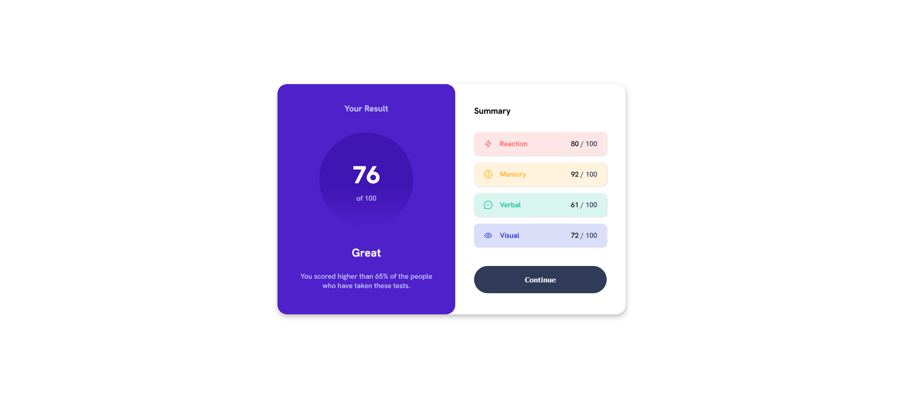
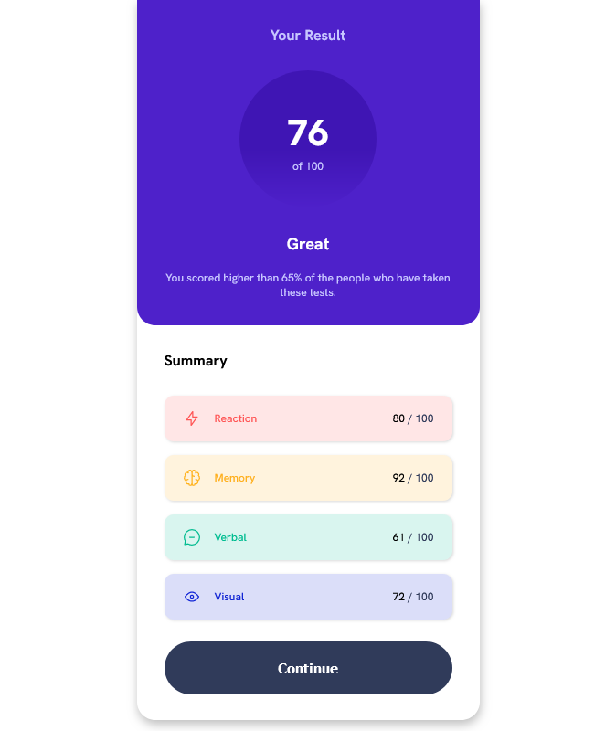

# Frontend Mentor - Interactive card details form solution

This is a solution to the [Results summary component challenge on Frontend Mentor](https://www.frontendmentor.io/challenges/results-summary-component-CE_K6s0maV). Frontend Mentor challenges help you improve your coding skills by building realistic projects.

## Table of contents

-   [Overview](#overview)
    -   [The challenge](#the-challenge)
    -   [Screenshot](#screenshot)
    -   [Links](#links)
-   [My process](#my-process)
    -   [Built with](#built-with)
    -   [What I learned](#what-i-learned)
-   [Author](#author)

## Overview

### The challenge

Users should be able to:

-   View the optimal layout for the interface depending on their device's screen size
-   See hover and focus states for all interactive elements on the page
-   **Bonus**: Use the local JSON data to dynamically populate the content

### Screenshot

**Desktop View\***


**Mobile View**


### Links

[Solution URL](https://github.com/BinLama/FrontendMentor-results-summary-component)

-   Live Site URL: [Add live site URL here](https://your-live-site-url.com)

## My process

### Built with

-   [React](https://reactjs.org/) - JS library
-   CSS custom properties
-   Flexbox
-   CSS Grid
-   Desktop-first workflow

### What I learned

I am proud of implementing animating number without any help. This is the code that I used.

```js
useEffect(() => {
    const id = setTimeout(() => {
        if (scores != max) {
            setScores((prev) => prev + 1);
        }
    }, 10);

    return () => {
        clearTimeout(id);
    };
}, [scores]);
```

It basically keeps track of the number that is incrementing and when it changes, it calls the function again but stops when it matches the max value.

## Author

-   Frontend Mentor - [@BinLama](https://www.frontendmentor.io/profile/BinLama)
-   Github - [@BinLama](https://github.com/BinLama)
